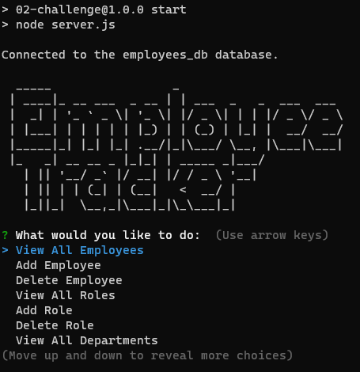

# Employee Management System

## Description

This is a command-line application for managing employees in a company. It allows users to view, add, update, and delete employees, as well as manage their roles and departments. The application is built using Node.js, Express, MySQL, and the inquirer library for command-line prompts.

## Installation

1. Clone the repository to your local machine.
2. Install Node.js on your machine, if not already installed.
3. Open a terminal and navigate to the root directory of the cloned repository.
4. Run the following command to install the required dependencies:

        npm install

5. Set up a MySQL database by running the provided SQL script employees_db.sql in your MySQL server.

## Usage
1. Update the db variable in the code to configure the connection to your MySQL database. Modify the host, user, password, and database properties as needed.

        const db = sql.createConnection({
            host: "localhost",
            user: "root",
            password: "Password1",
            database: "employees_db",
        });

2. Start the application by running the following command in the terminal:

        node index.js

3. Follow the prompts in the command-line interface to interact with the application and manage employees, roles, and departments.

## Features

- View all employees: Displays a table of all employees in the database.
- Add employee: Prompts the user to enter employee details and adds them to the database.
- Delete employee: Prompts the user to enter the employee ID and deletes the corresponding employee from the database.
- Update employee manager: Prompts the user to enter the employee ID and the new manager name, and updates the manager of the employee in the database.
- Update employee role: Prompts the user to enter the employee ID and the new job title, and updates the role of the employee in the database.
- Search employees by manager: Prompts the user to enter the manager name and displays a table of employees who report to that manager.
- Search employees by department: Prompts the user to enter the department name and displays a table of employees in that department.
- Add role: Prompts the user to enter role details and adds them to the database.
- View all roles: Displays a table of all roles in the database.
- View all departments: Displays a table of all departments in the database.
- Add department: Prompts the user to enter department details and adds them to the database.
- Quit: Exits the application.

## Contributing

Contributions to this project are welcome. Please fork the repository, make your changes, and submit a pull request.

## License

This project is licensed under the MIT License.

## Credits

This application was created by Martin Lynch.

## [Video Demo](https://youtu.be/nQ2ZYOl-oOQ)